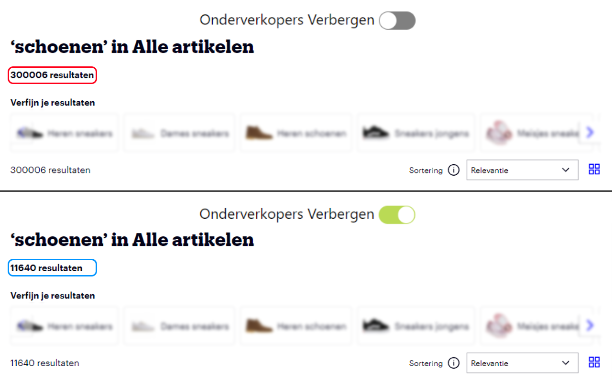

# BolFilter

Filter onderverkopers uit de zoekresultaten van Bol.com door een verborgen zoekfilter toe te passen.

## Installatie via de webstore

 **Chrome** <small>(Aanvraag in behandeling)</small>
<!--  **Firefox** <small>(Aanvraag in behandeling)</small> -->

## Installatie via source ( Chrome)

1. Download de laatste versie van de BolFilter Extension via de <a href="https://github.com/jkctech/BolFilter/releases" target="_blank">Releases</a> tab.
1. Pak de bestanden uit in een map op je computer.
1. Volg de "<a href="https://developer.chrome.com/docs/extensions/mv3/getstarted/development-basics/#load-unpacked" target="_blank">Loading an unpacked extension</a>" instructies van Google

## Voorbeeld

